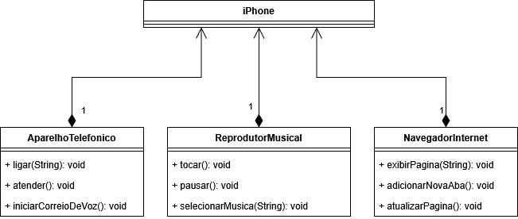

# iPhone 2007: UML e Programação Orientada a Objetos

Este é um projeto de estudo desenvolvido seguindo as aulas da Digital Innovation One (DIO), que simula a criação de um iPhone 2007 utilizando conceitos de Programação Orientada a Objetos (POO).

## UML

## Conceitos Utilizados

Neste projeto, foram aplicados os seguintes conceitos de Programação Orientada a Objetos (POO):

1. **Encapsulamento**: Cada funcionalidade do iPhone 2007 foi implementada em classes separadas (`AparelhoTelefonico`, `NavegadorInternet` e `ReprodutorMusical`), garantindo que os dados e métodos relacionados estejam agrupados e protegidos.

2. **Composição**: A classe principal `Iphone` utiliza instâncias das classes mencionadas acima como seus atributos, demonstrando a relação "tem-um" entre o iPhone e suas funcionalidades.

3. **Modularidade**: O código foi organizado em módulos, com cada funcionalidade implementada em arquivos separados, facilitando a manutenção e a escalabilidade do projeto.

4. **Abstração**: As classes encapsulam os detalhes de implementação, expondo apenas os métodos necessários para interação, como `ligar`, `tocar` e `exibirPagina`.

Além disso, o projeto foi planejado utilizando diagramas UML, que ajudaram a estruturar o sistema antes da implementação, promovendo uma visão clara das relações entre as classes e seus comportamentos.
